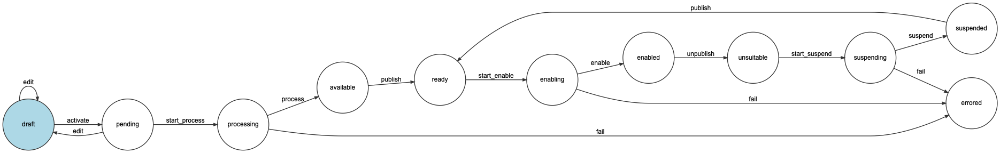

# Novactive eZ SiteAccess Factory Bundle

Novactive eZ SiteAccess Factory Bundle is an eZPlatform bundle that will allow you to create SiteAccess (website) on 
the fly on top of an existing eZ Platform instance.

!!!!

- **NOTE**: This is currently in BETA but is pretty stable.
- **WE ARE LOOKING FOR FEEDBACK**: Don't hesite to create issue, ask questions, etc.

- Contributions are welcome!

Introduction video here: https://youtu.be/Xtyw_aWM0Gc

!!!!

## Features

Site Access creation might be complex sometimes, but can also be really simple when you are doing a Web Factory.

This bundle will give you the power to, **on the fly**:

- create and enable a new SiteAccess (or a translation of an existing one).
    -  create a new Top Location in the Content Repository
    -  create a new Group Top Location in the Content Repository
    -  create a new Admin Group in the previous
    -  create/update a Admin in the Admin Group
    
- plus you get a Configuration Content places underneath the Top Location of your SiteAccess (accessible in Twig) to 
  retreive Configuration of the SiteAccess like (logo, description, footer etc.)    
        
- give permissions when needed on Anonynous to release that SiteAccess.
- unpublish a SiteAccss (by removing permissions on Anonymous)

> **On the fly**! It means NO DEVLEOPMENT REQUIRED!
 
The bundle introduces a new Entity called  "Site Configuration". A Site Configuration describes a SiteAccess with 
information like:
- languages
- name
- design
- etc.

Then, thanks to a State Machine and a new Tab in the Admin Interface, this workflow is possible

## How it works

Behing the scene, this bundle will save the Site Access configurations in many JSON files. 1 per Site Configuration and 
outside of the source code). Those files are then used at compile time to inject the Site Access inside eZ Platform.

After each changes cache is cleared.

## Usage and installation instructions

[Installation](documentation/INSTALL.md)

[Usage](documentation/USAGE.md)

Change and License
------------------

[Changelog](documentation/CHANGELOG.md)

[License](LICENSE)

Credits
-------

This bundle uses

- [Symfony Components](https://symfony.com) (Worklow, Configuration, Dependency Injection, etc.)
- [eZ Platform](https://ezplatform.com) by [eZ Systems](https://ez.no)
- [Nova eZ Extra Bundle](https://github.com/Novactive/NovaeZExtraBundle) by [Novactive](https://www.novactive.us)
- [Kaliop Migration Bundle](https://github.com/kaliop-uk/ezmigrationbundle) by [Kaliop UK](https://www.kaliop.co.uk/)

Thank you to all the Contributors of those bundles but also to all the underlying librairy Contributors.

Special thank you to [Atlantic](https://atlantic.fr) and **Novactive** for their support.
